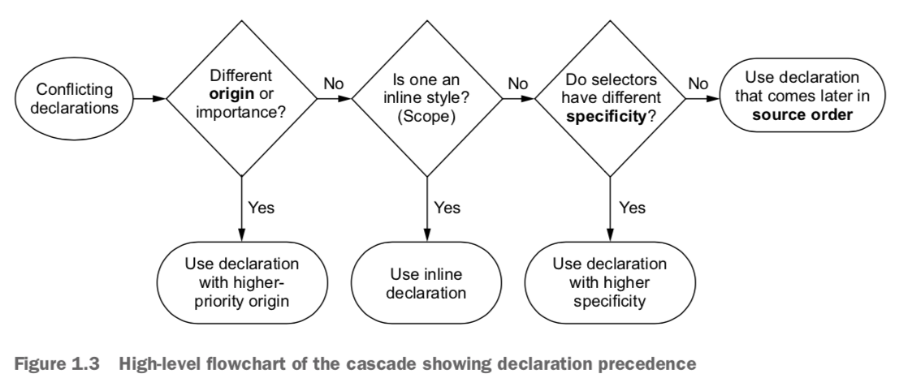
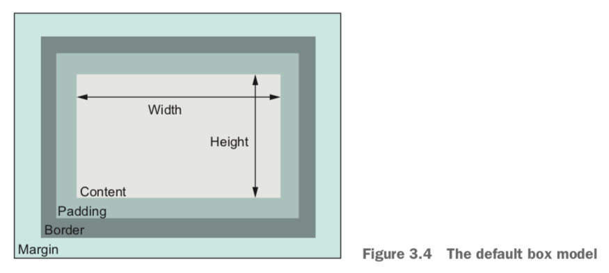
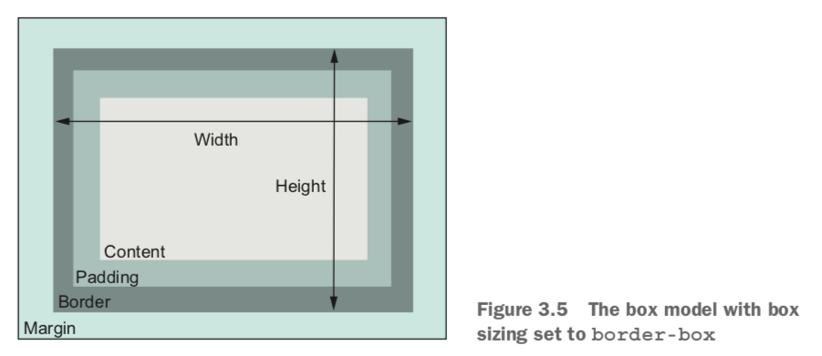
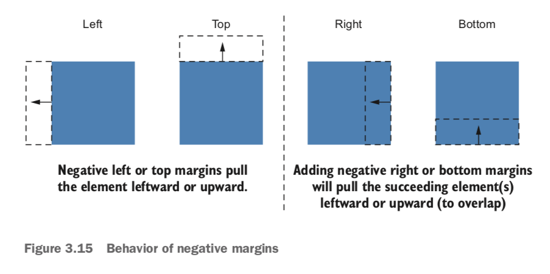
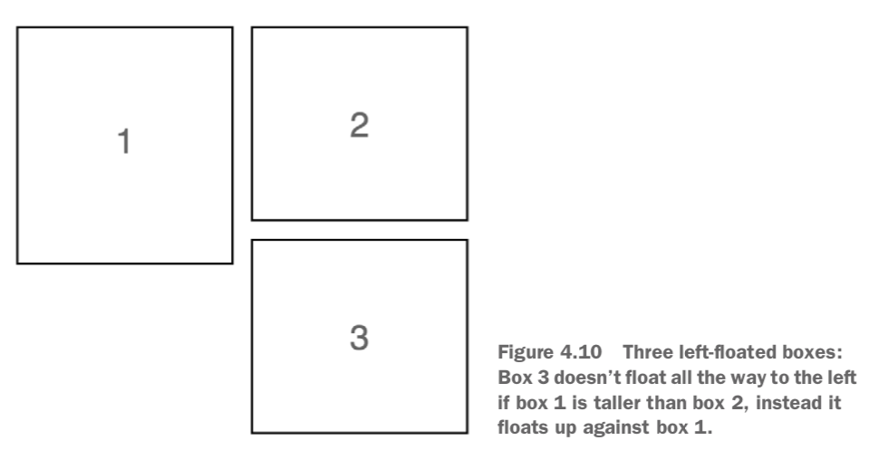
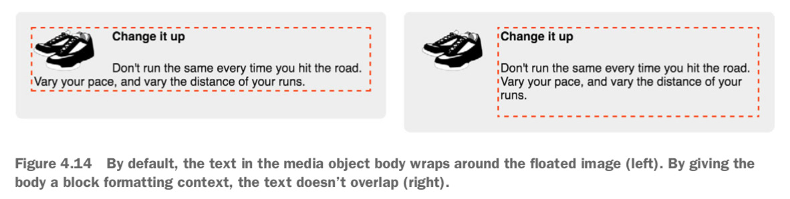
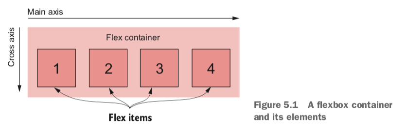

# CSS in Depth

Keith J. Grant

## 1. Cascade, specificity, and inheritance

### Cascade

When declarations conflict, the cascade considers three things to resolve the difference:

1. *Stylesheet origin* — Where the styles come from. Your styles are applied in conjunction with the browser’s default styles.
2. *Selector specificity* — Which selectors take precedence over which.
3. *Source order* — Order in which styles are declared in the stylesheet.



#### Stylesheet origin

1. Author important (`!important` added to the end of declaration)
2. Author
3. User agent

#### Specificity

- Inline styles have no selector because they are applied directly to the element they target. To override inline declarations in your stylesheet, you’ll need to add an `!important` to the declaration, shifting it into a higher-priority origin. If the inline styles are marked important, then nothing can override them. It’s preferable to do this from within the stylesheet.
- Selector specificity (ID > Class > Tag):
  - If a selector has more IDs, it wins.
  - If that results in a tie, the selector with the most classes wins.
  - If that results in a tie, the selector with the most tag names wins.

Notes:

- Pseudo-class selectors (for example, `:hover`) and attribute selectors (for example, `[type="input"]`) each have the same specificity as a class selector. The universal selector (`*`) and combinators (`>`, `+`, `~`) have no effect on specificity.
- If you need to override a style applied using an ID, you have to use another ID.
- It is generally best to keep specificity low when you can, so when you need to override something, your options are open.

#### Source order

If the origin and the specificity are the same, then the declaration that appears later in the stylesheet—or appears in a stylesheet included later on the page—takes precedence.

### Two rules of thumb

1. Don't use IDs in your selector.
2. Don't use `!important`.

Include a stylesheet for your component. If your component needs to make style changes dynamically, it's almost always preferable to use JavaScript to add and remove classes to the elements.

### Inheritance

If an element has no cascaded value for a given property, it may inherit one from an ancestor element.

Primarily properties pertaining to text, list properties, and table border properties are inherited.

In browser's dev tools, the style inspector shows every selector targeting the inspected element, ordered by specificity. Styles closer to the top override those below. Overridden styles are crossed out.

`inherit`: You can override another value with this, and it will cause the element to inherit that value from its parent.

`initial`: If you assign the value `initial` to a property, then it effectively resets to its default value.

Examples:

- `border: initial`: Remove a border from an element.
- `width: initial`: Restore an element to its default width. Or use `width: auto`, because the default value of `width` is `auto`.

### Shorthand properties

Most shorthand properties let you omit certain values and only specify the bits you’re concerned with. Note that doing this still sets the omitted values to their initial value.

**Top, Right, Bottom, Left**: The order of properties that apply individually to all four sides of the box like a clock (e.g., `margin` and `padding`). If the declaration ends before one of the four sides is given a value, that side takes its value from the opposite side. If you specify only one value, it will apply to all four sides.

**Horizontal, Vertical**: The order of properties that only support up to two values (e.g., `background-position`). The two values represent a Cartesian grid.

## Working with relative units

When you’ve multiple ways to solve a particular problem, you’ll need to favor the solution that works more generally under multiple and different circumstances.

### em

`em`: 1 em means the font size of the current element.

Using ems can be convenient when setting properties like `padding`, `height`, `width`, or `border-radius` because these will scale evenly with the element if it inherits different font sizes, or if the user changes the font settings.

`font-size` ems are derived from the *inherited* font size. For most browsers, the default font size is 16px.

### rem

`rem`: relative to the root element.

The `:root` pseudo-class selector is equivalent to the `html` type selector.

Use rems for font sizes, pixels for borders, and ems for most other measures, especially paddings, margins, and border radius. Use percentages for container widths when necessary.

### Setting default font size

```css
:root {
    font-size: 0.875em; /* 14 px; 14/16 = 0.875 */
}
```

### Viewport-relative units

Viewport-relative units define lengths relative to the browser's viewport.

- `vh`: 1/100th of the viewport height
- `vw`: 1/100th of the viewport width
- `vmin`: 1/100th of the smaller dimension, height or width
- `vmax`: 1/100th of the larger dimension, height or width

Using `calc()` for font size;

```css
:root {
    font-size: calc(0.5em + 1vw);
}
```

This will make the font scale smoothly.

### Unitless numbers

Properties that allow for unitless values:

- `line-height`: this can prevent the overlapping text because of small line height.
- `z-index`
- `font-weight`: `700` is equivalent to bold; `400` is equivalent to normal

Example:

```css
body {
    line-height: 1.2; /* Descendant elements inherit the unitless value */
}
```

When you use a unitless number, that declared value is inherited, meaning its com- puted value is recalculated for each inheriting child element.

### Custom properties (CSS variables)

The name must begin with two hypthens (`--`). Variables must be declared inside a declaration block.

Example:

```css
:root {
    --main-font: Helvetica, Arial, sans-serif;
    --brand-color: #369;
}

p {
    font-family: var(--main-font, sans-serif);
    color: blue; /* fallback */
    color: var(--brand-color, blue); /* blue is the fallback value */
}
```

The `var()` function accepts a second parameter, which specifies a fallback value.

The declarations of custom properties cascade and inherit: You can define the same variable inside multiple selectors, and the variable will have a different value for various parts of the page. The custom properties behave as a sort of scoped variable because the values are inherited by descendant elements.

Use JavaScript to access custom properties:

```javascript
var rootElement = document.documentElement;
var styles = getComputedStyle(rootElement);
var mainColor = styles.getPropertyValue('--main-bg');

rootElement.style.setProperty('--main-bg', '#cdf');
```

## Mastering the box model

When you set the width or height of an element, you’re specifying the width or height of its *content*; any padding, border, and margins are then added to that width.



By default, `box-sizing` is set to the value of `content-box`. This means that any height or width you specify only sets the size of the content box.

You can set `box-sizing` to `border-box`, then the `height` and `width` properties set the combined size of the content, padding, and border. With this model, padding doesn’t make an element wider; it makes the inner content narrower. It also does the same for height.



Apply border box sizing to all elements and pseudo-elements on the page:

```css
/* Adding this snippet near the beginning of your stylesheet */
:root {
    box-sizing: border-box;
}

*,
::before,
::after {
    box-sizing: inherit;
}
```

### Element height

Typically it’s best to avoid setting explicit heights on elements. The height of a container is organically determined by its contents, not by the container itself. When you explicitly set an element’s height, you run the risk of its contents overflowing the container.

`overflow` controls the behavior of overflowing content:

- `visible`: default value; all content is visible, even when it overflows the container’s edges.
- `hidden`: content that overflows the container’s padding edge is clipped and won’t be visible.
- `scroll`: scrollbars are added to the container so the user can scroll to see the remaining content.
- `auto`: scrollbars are added to the container only if the contents overflow.

You can use `overflow-x` or `overflow-y` to control only horizontal or vertical overflow. Explicitly setting both `overflow-x` and `overflow-y` to different values, however, tends to have unpredictable results.

Specifying height using a percentage is problematic. A better approach is to use the viewport-relative `vh` units.

#### Columns of equal height

By default, using a flexbox produces elements of equal height. By applying `display: flex` to the container, it becomes a *flex container*. Its child elements will become the same height by default.

`min-height` and `max-height`: you specify a minimum or maximum value, allowing the element to size naturally within those bounds.

Similar properties `min-width` and `max-width` constrain an element’s width.

#### Vertically centering content

A `vertical-align` declaration only affects inline and table-cell elements. With inline elements, it controls alignment among other elements on the same line. You can use it to control how an inline image aligns with the neighboring text, for example. With table-cell elements, `vertical-align` controls the alignment of the contents within the cell.

Options:

- Can you use a natural height container? Apply an equal top and bottom padding to the container to center its contents.
- Do you need a specific height container, or do you need to avoid using padding? Use `display: table-cell` and `vertical-align: middle` on your container.
- Can you use flexbox? Use `align-items:center`.
- Is the inner content only one line of text? Set a tall line height equal to the desired container height. This will force the container to grow to contain the line height. If the contents aren’t inline, you may have to set them to `inline-block`.

Reference: http://howtocenterincss.com

### Negative margins



### Collapsed margins

*Collapsing*: When top and/or bottom margins are adjoining, they overlap, combining to form a single margin. The size of the collapsed margin is equal to the *largest* of the joined margins.

Example: Paragraphs (`<p>`), by default, have a 1 em top margin and a 1 em bottom margin. When you stack two paragraphs, one after the other, their margins don’t add up to a gap of 2 em. Instead they collapse, overlapping to produce only 1 em of space between the two paragraphs.

This behavior typically means you can style margins on various elements without much concern for what might appear above or below them. The collapsed margin between the elements only appears larger if the following element requires more space.

Note: Margin collapsing only occurs with top and bottom margins. Left and right margins don’t collapse.

Ways to prevent margins from collapsing:

- Apply `overflow: auto` (or any value other than `visible`) to the container prevents margins inside the container from collapsing with those outside the container. This is often the least intrusive solution.
- Add a border or padding between two margins stops them from collapsing.
- Margins won’t collapse to the outside of a container that is floated, that is an inline block, or that has an absolute or fixed position.
- When using a flexbox, margins won’t collapse between elements that are part of the flex layout. This is also the case with grid layout.
- Elements with a `table-cell` display don’t have a margin, so they won’t collapse. This also applies to `table-row` and most other table display types. Exceptions are `table`, `table-inline`, and `table-caption`.

### Spacing elements within a container

`* + *` targets any element that immediately follows any other element. That is, it selects all elements on the page that aren’t the first child of their parent. You’ll have to override it in places where you don’t want it to apply.

## Floats

Purpose of floats: A float pulls an element (often an image) to one side of its container, allowing the document flow to wrap around it.

A floated element is removed from the normal document flow and pulled to the edge of the container. The document flow then resumes, but it’ll wrap around the space where the floated element now resides.

Floats are still the only way to move an image to the side of the page and allow text to wrap around it.

The browser places floats as high as possible.



*Double container pattern*: Place the content inside two nested containers and then set margins on the inner container to position it within the outer one (e.g., center page contents).

### Container collapsing and the clearfix

Unlike elements in the normal document flow, floated elements do not add height to their parent elements.

`clear: both`: Causes the element to move below the bottom of floated elements, rather than beside them. You can give `clear` the value `left` or `right` to clear only elements floated to the left or right, respectively. (Note: this sizes the container how you want, but it’s rather hacky.)

### clearfix

By using the `::after` pseudo-element selector, you can effectively insert an element into the DOM at the end of the container, without adding it to the markup.

Example:

```css
/* Apply clearfix to the element that contains the floats */
/* Contain any child elements’ margins at both the top and bottom of the container */

.clearfix::before,
.clearfix::after {
  display: table;
  content: " ";
}

.clearfix::after {
  clear: both;
}
```

### Media object and block formatting context

Use the media object pattern to position descriptive text alongside an image.

By default, the text in the media object body wraps around the floated image (left). By giving the body a block formatting context, the text doesn’t overlap (right).



*Block formatting context (BFC)*: a region of the page in which elements are laid out. A block formatting context itself is part of the surrounding document flow, but it isolates its contents from the outside context. This isolation does three things for the element that establishes the BFC:

- It contains the top and bottom margins of all elements within it. They won’t col- lapse with margins of elements outside of the block formatting context.
- It contains all floated elements within it.
- It doesn’t overlap with floated elements outside the BFC.

Put simply, the contents inside a block formatting context will not overlap or interact with elements on the outside as you would normally expect.

Applying any of the following property values to an element triggers a BFC:

- `float: left` or `float: right`: anything but `none`.
- `overflow: hidden`, `auto`, or `scroll`: anything but `visible`.
- `display: inline-block`, `table-cell`, `table-caption`, `flex`, `inline-flex`, `grid`, or `inline-grid`: these are called block containers.
- `position: absolute` or `position: fixed`.

Using `overflow: auto` for the BFC is generally the simplest approach.

A `float` or an `inline-block` will grow to 100% width, so you’d need to restrict the width of the element to prevent it from line wrapping below the float. On the contrary, a `table-cell` element will only grow enough to contain its contents, so you may need to set a large width to force it to fill the remaining space.

### Grid system

Use a grid system to create a wide array of page layouts.

A *grid system* is a series of class names you can add to your markup to structure portions of the page into rows and columns. It should provide no visual styles, like colors or borders, to the page—it should only set widths and positions of containers. Inside each of these containers, you can add new elements to visually style however you want.

A grid system is usually defined to hold a certain number of columns in each row; this is usually 12, but that can vary. The child elements of a row may have a width anywhere from one column up to 12 columns wide.

The general principle of a grid system: put a row container around one or more column containers. The classes applied to the column containers will each determine their respective widths.

Example:

```css
<div class="row">
  <div class="column-4">4 column</div>
  <div class="column-8">8 column</div>
</div>
```

## Flexbox

Applying `display: flex` to an element turns it into a *flex container*, and its direct children turn into *flex items*. By default, flex items align side by side, left to right, all in one row. The flex container fills the available width like a block element, but the flex items may not necessarily fill the width of their flex container. The flex items are all the same height, determined naturally by their contents.



Set `display: block` to links: Makes links block level so they add to the parent elements’ height. The height links contribute to their parent would be derived from their padding and content. If `display: inline`, the height they contribute to parents will be the links' line height.

Auto margins inside a flexbox will fill the available space.

### Flex item sizes

The `flex` property is shorthand for three different sizing properties: `flex-grow`, `flex-shrink`, and `flex-basis`. For example, `flex: 2` is equivalent to `flex: 2 1 0%`. `1`, `1` and `0%` are default values of `flex-grow`, `flex-shrink` and `flex-basis`.

The `flex-basis` defines a sort of starting point for the size of an element—an initial “main size.” The `flex-basis` property can be set to any value that would apply to `width`, including values in px, ems, or percentages. Its initial value is `auto`, which means the browser will look to see if the element has a `width` declared. If so, the browser uses that size; if not, it determines the element’s size naturally by the contents. This means that `width` will be ignored for elements that have any flex basis other than `auto`.

Flex items can consume remaining space based on `flex-grow` values:

- `flex-grow: 0`: the item will not grow past its `flex-basis`.
- `flex-grow: n`: `n` is a non-zero number. The item will grow until all of the remaining space is used up. Declaring a higher `flex-grow` value gives that element more “weight”; it’ll take a larger portion of the remainder. An item with `flex-grow: 2` will grow twice as much as an item with `flex-grow: 1`.

The `flex-shrink` value for each item indicates whether it should shrink to prevent overflow. If an item has a value of `flex-shrink: 0`, it will not shrink. Items with a value greater than 0 will shrink until there is no overflow. An item with a higher value will shrink more than an item with a lower value, proportional to the `flex-shrink` values.