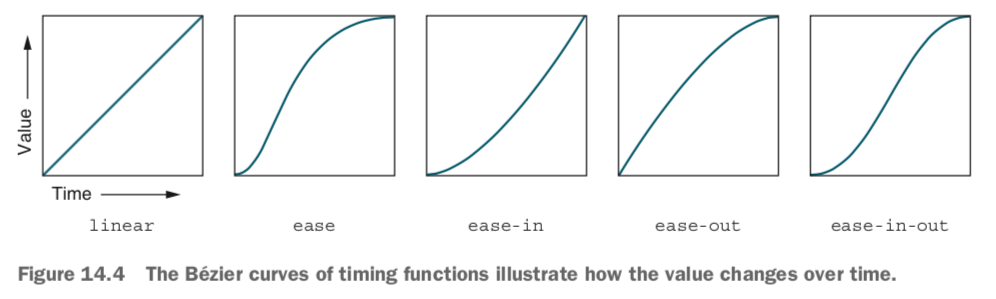

## Transitions

A transition takes place any time a property on an element is changed. This can occur on a state change like `:hover` or if JavaScript changes something, such as adding or removing a class that affects the element’s styles.

Example:

```css
transition: background-color 0.3s linear 0.5s; /* transition-property, transition-duration, transition-timing-function, transition-delay */
```

### Timing functions

Keyword values include:

- `linear`: the value changes at a constant rate.
- `ease-in`: the rate of change starts out slow, but accelerates until the end of the transition.
- `ease-out`: starting with a rapid change and ending slowly.



Selecting a timing function;

- Linear: color changes and fade in/out effects
- Decelerating: user-initiated changes. When the user clicks a button or hovers over an element, use `ease-out` or something similar. This way, the user will see a fast, instant response to their input, easing out as the element comes to a stop.
- Accelerating: System-initiated changes. When content finishes loading or a timeout event triggers, use `ease-in` or something similar. This way, the element will ease in at first to draw the user’s attention before the element speeds up and completes its motion.
- Larger or more playful motions: use either an `ease-in-out` (accelerate then decelerate) or a bounce effect.

Custom Bézier curve: `cubic-bezier(0.45, 0.05, 0.55, 0.95)`. The four values represent the x- and y-coordinates of the two handles’ control points.

GUI tool for creating custom Bézier curve: [http://cubic-bezier.com/](http://cubic-bezier.com/)

Steps: `steps(3, end)`. Parameters: the number of steps and a keyword (either `start` or `end`), indicating whether each change should take place at the start or end of each step.

As a rule of thumb, most of your transitions should be somewhere between **200 and 500 ms**. Use quick transition speeds (below 300 ms) for hover effects, fades, and small scaling effects. For transitions that involve large moves or complex timing functions (e.g., bounces), use slightly longer transitions between 300 and 500 ms.