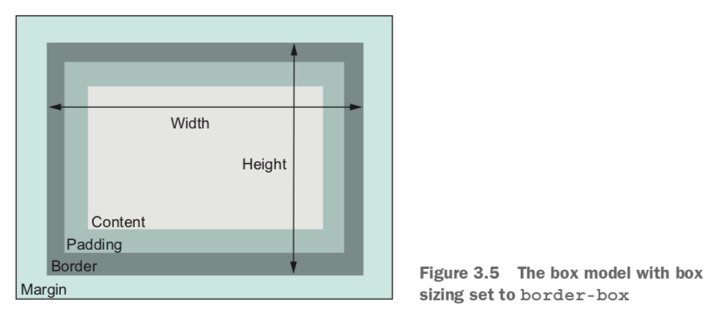

## 3. Mastering the box model

When you set the width or height of an element, you’re specifying the width or height of its *content*; any padding, border, and margins are then added to that width.


By default, `box-sizing` is set to the value of `content-box`. This means that any height or width you specify only sets the size of the content box.

You can set `box-sizing` to `border-box`, then the `height` and `width` properties set the combined size of the content, padding, and border. With this model, padding doesn’t make an element wider; it makes the inner content narrower. It also does the same for height.



Apply border box sizing to all elements and pseudo-elements on the page:

```css
/* Adding this snippet near the beginning of your stylesheet */
:root {
    box-sizing: border-box;
}

*,
::before,
::after {
    box-sizing: inherit;
}
```

### Element height

Typically it’s best to avoid setting explicit heights on elements. The height of a container is organically determined by its contents, not by the container itself. When you explicitly set an element’s height, you run the risk of its contents overflowing the container.

`overflow` controls the behavior of overflowing content:

- `visible`: default value; all content is visible, even when it overflows the container’s edges.
- `hidden`: content that overflows the container’s padding edge is clipped and won’t be visible.
- `scroll`: scrollbars are added to the container so the user can scroll to see the remaining content.
- `auto`: scrollbars are added to the container only if the contents overflow.

You can use `overflow-x` or `overflow-y` to control only horizontal or vertical overflow. Explicitly setting both `overflow-x` and `overflow-y` to different values, however, tends to have unpredictable results.

Specifying height using a percentage is problematic. A better approach is to use the viewport-relative `vh` units.

#### Columns of equal height

By default, using a flexbox produces elements of equal height. By applying `display: flex` to the container, it becomes a *flex container*. Its child elements will become the same height by default.

`min-height` and `max-height`: you specify a minimum or maximum value, allowing the element to size naturally within those bounds.

Similar properties `min-width` and `max-width` constrain an element’s width.

#### Vertically centering content

A `vertical-align` declaration only affects inline and table-cell elements. With inline elements, it controls alignment among other elements on the same line. You can use it to control how an inline image aligns with the neighboring text, for example. With table-cell elements, `vertical-align` controls the alignment of the contents within the cell.

Options:

- Can you use a natural height container? Apply an equal top and bottom padding to the container to center its contents.
- Do you need a specific height container, or do you need to avoid using padding? Use `display: table-cell` and `vertical-align: middle` on your container.
- Can you use flexbox? Use `align-items:center`.
- Is the inner content only one line of text? Set a tall line height equal to the desired container height. This will force the container to grow to contain the line height. If the contents aren’t inline, you may have to set them to `inline-block`.

[How to Center in CSS](http://howtocenterincss.com)

### Negative margins


### Collapsed margins

*Collapsing*: When top and/or bottom margins are adjoining, they overlap, combining to form a single margin. The size of the collapsed margin is equal to the *largest* of the joined margins.

Example: Paragraphs (`<p>`), by default, have a 1 em top margin and a 1 em bottom margin. When you stack two paragraphs, one after the other, their margins don’t add up to a gap of 2 em. Instead they collapse, overlapping to produce only 1 em of space between the two paragraphs.

This behavior typically means you can style margins on various elements without much concern for what might appear above or below them. The collapsed margin between the elements only appears larger if the following element requires more space.

Note: Margin collapsing only occurs with top and bottom margins. Left and right margins don’t collapse.

Ways to prevent margins from collapsing:

- Apply `overflow: auto` (or any value other than `visible`) to the container prevents margins inside the container from collapsing with those outside the container. This is often the least intrusive solution.
- Add a border or padding between two margins stops them from collapsing.
- Margins won’t collapse to the outside of a container that is floated, that is an inline block, or that has an absolute or fixed position.
- When using a flexbox, margins won’t collapse between elements that are part of the flex layout. This is also the case with grid layout.
- Elements with a `table-cell` display don’t have a margin, so they won’t collapse. This also applies to `table-row` and most other table display types. Exceptions are `table`, `table-inline`, and `table-caption`.

### Spacing elements within a container

`* + *` targets any element that immediately follows any other element. That is, it selects all elements on the page that aren’t the first child of their parent. You’ll have to override it in places where you don’t want it to apply.