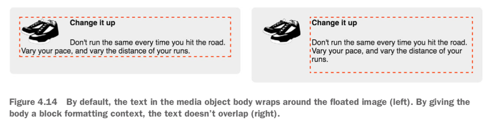

## 4. Floats

Purpose of floats: A float pulls an element (often an image) to one side of its container, allowing the document flow to wrap around it.

A floated element is removed from the normal document flow and pulled to the edge of the container. The document flow then resumes, but it’ll wrap around the space where the floated element now resides.

Floats are still the only way to move an image to the side of the page and allow text to wrap around it.

The browser places floats as high as possible.


*Double container pattern*: Place the content inside two nested containers and then set margins on the inner container to position it within the outer one (e.g., center page contents).

### Container collapsing and the clearfix

Unlike elements in the normal document flow, floated elements do not add height to their parent elements.

`clear: both`: Causes the element to move below the bottom of floated elements, rather than beside them. You can give `clear` the value `left` or `right` to clear only elements floated to the left or right, respectively. (Note: this sizes the container how you want, but it’s rather hacky.)

### clearfix

By using the `::after` pseudo-element selector, you can effectively insert an element into the DOM at the end of the container, without adding it to the markup.

Example:

```css
/* Apply clearfix to the element that contains the floats */
/* Contain any child elements’ margins at both the top and bottom of the container */

.clearfix::before,
.clearfix::after {
  display: table;
  content: " ";
}

.clearfix::after {
  clear: both;
}
```

### Media object and block formatting context

Use the media object pattern to position descriptive text alongside an image.

By default, the text in the media object body wraps around the floated image (left). By giving the body a block formatting context, the text doesn’t overlap (right).



*Block formatting context (BFC)*: a region of the page in which elements are laid out. A block formatting context itself is part of the surrounding document flow, but it isolates its contents from the outside context. This isolation does three things for the element that establishes the BFC:

- It contains the top and bottom margins of all elements within it. They won’t col- lapse with margins of elements outside of the block formatting context.
- It contains all floated elements within it.
- It doesn’t overlap with floated elements outside the BFC.

Put simply, the contents inside a block formatting context will not overlap or interact with elements on the outside as you would normally expect.

Applying any of the following property values to an element triggers a BFC:

- `float: left` or `float: right`: anything but `none`.
- `overflow: hidden`, `auto`, or `scroll`: anything but `visible`.
- `display: inline-block`, `table-cell`, `table-caption`, `flex`, `inline-flex`, `grid`, or `inline-grid`: these are called block containers.
- `position: absolute` or `position: fixed`.

Using `overflow: auto` for the BFC is generally the simplest approach.

A `float` or an `inline-block` will grow to 100% width, so you’d need to restrict the width of the element to prevent it from line wrapping below the float. On the contrary, a `table-cell` element will only grow enough to contain its contents, so you may need to set a large width to force it to fill the remaining space.

### Grid system

Use a grid system to create a wide array of page layouts.

A *grid system* is a series of class names you can add to your markup to structure portions of the page into rows and columns. It should provide no visual styles, like colors or borders, to the page—it should only set widths and positions of containers. Inside each of these containers, you can add new elements to visually style however you want.

A grid system is usually defined to hold a certain number of columns in each row; this is usually 12, but that can vary. The child elements of a row may have a width anywhere from one column up to 12 columns wide.

The general principle of a grid system: put a row container around one or more column containers. The classes applied to the column containers will each determine their respective widths.

Example:

```css
<div class="row">
  <div class="column-4">4 column</div>
  <div class="column-8">8 column</div>
</div>
```