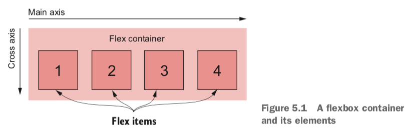

## 5. Flexbox

Applying `display: flex` to an element turns it into a *flex container*, and its direct children turn into *flex items*. By default, flex items align side by side, left to right, all in one row. The flex container fills the available width like a block element, but the flex items may not necessarily fill the width of their flex container. The flex items are all the same height, determined naturally by their contents.

Set `display: block` to links: Makes links block level so they add to the parent elements’ height. The height links contribute to their parent would be derived from their padding and content. If `display: inline`, the height they contribute to parents will be the links' line height.

Auto margins inside a flexbox will fill the available space.

General approach:

- Identify a container and its items and use `display: flex` on the container
- If necessary, set the `flex-direction` on the container
- Declare margins and/or `flex` values for the flex items where necessary to control their size

### Flex item sizes

The `flex` property is shorthand for three different sizing properties: `flex-grow`, `flex-shrink`, and `flex-basis`. For example, `flex: 2` is equivalent to `flex: 2 1 0%`. `1`, `1` and `0%` are default values of `flex-grow`, `flex-shrink` and `flex-basis`.

The `flex-basis` defines a sort of starting point for the size of an element—an initial “main size.” The `flex-basis` property can be set to any value that would apply to `width`, including values in px, ems, or percentages. Its initial value is `auto`, which means the browser will look to see if the element has a `width` declared. If so, the browser uses that size; if not, it determines the element’s size naturally by the contents. This means that `width` will be ignored for elements that have any flex basis other than `auto`.

Flex items can consume remaining space based on `flex-grow` values:

- `flex-grow: 0`: the item will not grow past its `flex-basis`.
- `flex-grow: n`: `n` is a non-zero number. The item will grow until all of the remaining space is used up. Declaring a higher `flex-grow` value gives that element more “weight”; it’ll take a larger portion of the remainder. An item with `flex-grow: 2` will grow twice as much as an item with `flex-grow: 1`.

The `flex-shrink` value for each item indicates whether it should shrink to prevent overflow. If an item has a value of `flex-shrink: 0`, it will not shrink. Items with a value greater than 0 will shrink until there is no overflow. An item with a higher value will shrink more than an item with a lower value, proportional to the `flex-shrink` values.

### Flex direction

`flex-direction`: Its initial value (`row`) causes the items to flow left-to-right. `flex- direction: column` causes the flex items to stack vertically (top to bottom). Flexbox also supports `row-reverse` to flow items right to left, and `column-reverse` to flow items bottom to top.

In CSS, working with height is fundamentally different than working with widths. A flex container will be 100% the available width, but the height is determined naturally by its contents. This behavior does not change when you rotate the main axis.

In a vertical flexbox, `flex-grow` and `flex-shrink` applied to the items will have no effect unless something else forces the height of the flex container to a specific size.

### Other flex container properties

- `flex-wrap`: This specifies whether flex items will wrap on to a new row inside the flex container (or on to a new column if `flex-direction` is `column` or `column-reverse` and something constrains the height of the container). When wrapping is enabled, the items don’t shrink according to their `flex-shrink` values. Instead, any items that would overflow the flex container wrap onto a new line.
  - `nowrap`: initial value
  - `wrap`
  - `wrap-reverse`
- `flex-flow`: Shorthand for `flex-direction` `flex-wrap`. Example: `flex-flow: column wrap`.
- `justify-content`: Controls how items are positioned along the **main axis**.
  - `flex-start`: default. No space between items unless the items have margins specified.
  - `flex-end`
  - `center`
  - `space-between`
  - `space-around`
  - Note: Spacing is applied after margins and flex-grow values are calculated. This means if any items have a non-zero `flex-grow` value, or any items have an `auto` margin on the main axis, then `justify-content` has no effect.
- `align-items`: Controls how items are positioned along the **cross axis**.
  - `stretch`: initial value. columns of equal height.
  - `flex-start`
  - `flex-end`
  - `center`
  - `baseline`: aligns the items so that the baseline of the first row of text in each flex item is aligned.
- `align-content`: If `flex-wrap` is enabled, this controls the spacing of the flex rows along the **cross axis**. If items don’t wrap, this property is ignored.
  - `flex-start`
  - `flex-end`
  - `center`
  - `stretch`: initial value
  - `space-between`
  - `space-around`

### Other flex item properties

- `align-self`: Controls how the item is aligned on the **cross axis**. This will override the container’s `align-items` value for specific item(s). Ignored if the item has an `auto` margin set on the cross axis.
  - `auto`: initial value. Defers to the container's `align-items` value.
  - `flex-start`
  - `flex-end`
  - `center`
  - `stretch`
  - `baseline`
- `order`: An integer that moves a flex item to a specific position among its siblings, disregarding source order.
  - Initially, all flex items have an order of `0`.
  - Specifying a value of `-1` to one item will move it to the beginning of the list.
  - A value of `1` will move it to the end.
  - You can specify order values for each item to rearrange them however you wish. The numbers don’t necessarily need to be consecutive.

Note: The line height of the text inside each flex item is what determines the height of each item.