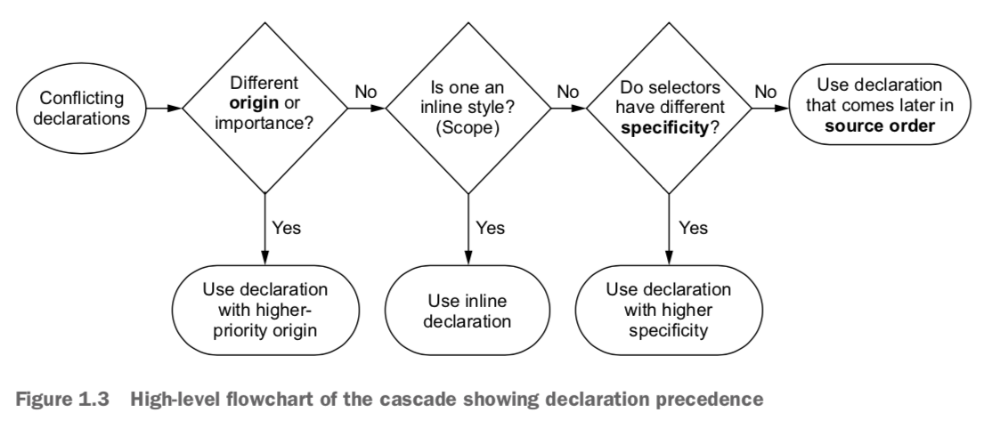
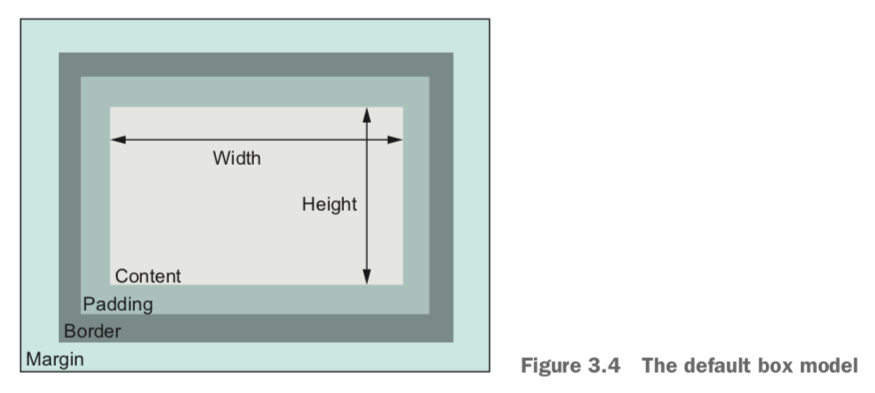
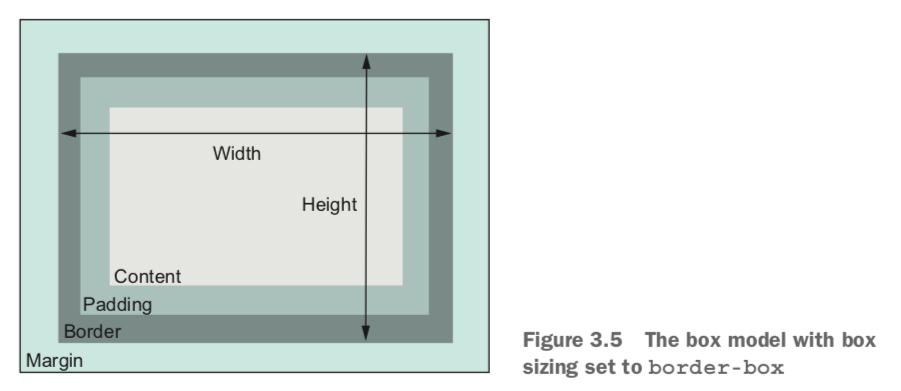
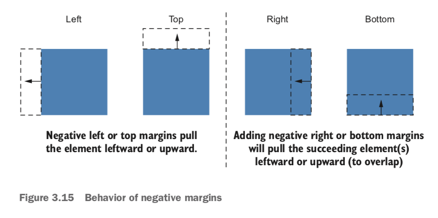
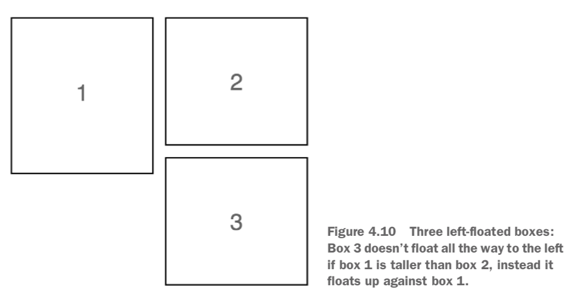
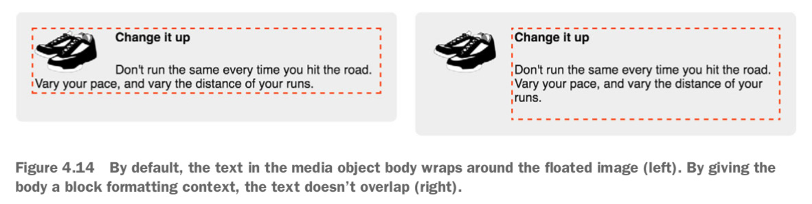

# CSS in Depth

Keith J. Grant

## 1. Cascade, specificity, and inheritance

### Cascade

When declarations conflict, the cascade considers three things to resolve the difference:

1. *Stylesheet origin* — Where the styles come from. Your styles are applied in conjunction with the browser’s default styles.
2. *Selector specificity* — Which selectors take precedence over which.
3. *Source order* — Order in which styles are declared in the stylesheet.



#### Stylesheet origin

1. Author important (`!important` added to the end of declaration)
2. Author
3. User agent

#### Specificity

- Inline styles have no selector because they are applied directly to the element they target. To override inline declarations in your stylesheet, you’ll need to add an `!important` to the declaration, shifting it into a higher-priority origin. If the inline styles are marked important, then nothing can override them. It’s preferable to do this from within the stylesheet.
- Selector specificity (ID > Class > Tag):
  - If a selector has more IDs, it wins.
  - If that results in a tie, the selector with the most classes wins.
  - If that results in a tie, the selector with the most tag names wins.

Notes:

- Pseudo-class selectors (for example, `:hover`) and attribute selectors (for example, `[type="input"]`) each have the same specificity as a class selector. The universal selector (`*`) and combinators (`>`, `+`, `~`) have no effect on specificity.
- If you need to override a style applied using an ID, you have to use another ID.
- It is generally best to keep specificity low when you can, so when you need to override something, your options are open.

#### Source order

If the origin and the specificity are the same, then the declaration that appears later in the stylesheet—or appears in a stylesheet included later on the page—takes precedence.

### Two rules of thumb

1. Don't use IDs in your selector.
2. Don't use `!important`.

Include a stylesheet for your component. If your component needs to make style changes dynamically, it's almost always preferable to use JavaScript to add and remove classes to the elements.

### Inheritance

If an element has no cascaded value for a given property, it may inherit one from an ancestor element.

Primarily properties pertaining to text, list properties, and table border properties are inherited.

In browser's dev tools, the style inspector shows every selector targeting the inspected element, ordered by specificity. Styles closer to the top override those below. Overridden styles are crossed out.

`inherit`: You can override another value with this, and it will cause the element to inherit that value from its parent.

`initial`: If you assign the value `initial` to a property, then it effectively resets to its default value.

Examples:

- `border: initial`: Remove a border from an element.
- `width: initial`: Restore an element to its default width. Or use `width: auto`, because the default value of `width` is `auto`.

### Shorthand properties

Most shorthand properties let you omit certain values and only specify the bits you’re concerned with. Note that doing this still sets the omitted values to their initial value.

**Top, Right, Bottom, Left**: The order of properties that apply individually to all four sides of the box like a clock (e.g., `margin` and `padding`). If the declaration ends before one of the four sides is given a value, that side takes its value from the opposite side. If you specify only one value, it will apply to all four sides.

**Horizontal, Vertical**: The order of properties that only support up to two values (e.g., `background-position`). The two values represent a Cartesian grid.

## 2. Working with relative units

When you’ve multiple ways to solve a particular problem, you’ll need to favor the solution that works more generally under multiple and different circumstances.

### em

`em`: 1 em means the font size of the current element.

Using ems can be convenient when setting properties like `padding`, `height`, `width`, or `border-radius` because these will scale evenly with the element if it inherits different font sizes, or if the user changes the font settings.

`font-size` ems are derived from the *inherited* font size. For most browsers, the default font size is 16px.

### rem

`rem`: relative to the root element.

The `:root` pseudo-class selector is equivalent to the `html` type selector.

Use rems for font sizes, pixels for borders, and ems for most other measures, especially paddings, margins, and border radius. Use percentages for container widths when necessary.

### Setting default font size

```css
:root {
    font-size: 0.875em; /* 14 px; 14/16 = 0.875 */
}
```

### Viewport-relative units

Viewport-relative units define lengths relative to the browser's viewport.

- `vh`: 1/100th of the viewport height
- `vw`: 1/100th of the viewport width
- `vmin`: 1/100th of the smaller dimension, height or width
- `vmax`: 1/100th of the larger dimension, height or width

Using `calc()` for font size;

```css
:root {
    font-size: calc(0.5em + 1vw);
}
```

This will make the font scale smoothly.

### Unitless numbers

Properties that allow for unitless values:

- `line-height`: this can prevent the overlapping text because of small line height.
- `z-index`
- `font-weight`: `700` is equivalent to bold; `400` is equivalent to normal

Example:

```css
body {
    line-height: 1.2; /* Descendant elements inherit the unitless value */
}
```

When you use a unitless number, that declared value is inherited, meaning its com- puted value is recalculated for each inheriting child element.

### Custom properties (CSS variables)

The name must begin with two hypthens (`--`). Variables must be declared inside a declaration block.

Example:

```css
:root {
    --main-font: Helvetica, Arial, sans-serif;
    --brand-color: #369;
}

p {
    font-family: var(--main-font, sans-serif);
    color: blue; /* fallback */
    color: var(--brand-color, blue); /* blue is the fallback value */
}
```

The `var()` function accepts a second parameter, which specifies a fallback value.

The declarations of custom properties cascade and inherit: You can define the same variable inside multiple selectors, and the variable will have a different value for various parts of the page. The custom properties behave as a sort of scoped variable because the values are inherited by descendant elements.

Use JavaScript to access custom properties:

```javascript
var rootElement = document.documentElement;
var styles = getComputedStyle(rootElement);
var mainColor = styles.getPropertyValue('--main-bg');

rootElement.style.setProperty('--main-bg', '#cdf');
```

## 3. Mastering the box model

When you set the width or height of an element, you’re specifying the width or height of its *content*; any padding, border, and margins are then added to that width.



By default, `box-sizing` is set to the value of `content-box`. This means that any height or width you specify only sets the size of the content box.

You can set `box-sizing` to `border-box`, then the `height` and `width` properties set the combined size of the content, padding, and border. With this model, padding doesn’t make an element wider; it makes the inner content narrower. It also does the same for height.



Apply border box sizing to all elements and pseudo-elements on the page:

```css
/* Adding this snippet near the beginning of your stylesheet */
:root {
    box-sizing: border-box;
}

*,
::before,
::after {
    box-sizing: inherit;
}
```

### Element height

Typically it’s best to avoid setting explicit heights on elements. The height of a container is organically determined by its contents, not by the container itself. When you explicitly set an element’s height, you run the risk of its contents overflowing the container.

`overflow` controls the behavior of overflowing content:

- `visible`: default value; all content is visible, even when it overflows the container’s edges.
- `hidden`: content that overflows the container’s padding edge is clipped and won’t be visible.
- `scroll`: scrollbars are added to the container so the user can scroll to see the remaining content.
- `auto`: scrollbars are added to the container only if the contents overflow.

You can use `overflow-x` or `overflow-y` to control only horizontal or vertical overflow. Explicitly setting both `overflow-x` and `overflow-y` to different values, however, tends to have unpredictable results.

Specifying height using a percentage is problematic. A better approach is to use the viewport-relative `vh` units.

#### Columns of equal height

By default, using a flexbox produces elements of equal height. By applying `display: flex` to the container, it becomes a *flex container*. Its child elements will become the same height by default.

`min-height` and `max-height`: you specify a minimum or maximum value, allowing the element to size naturally within those bounds.

Similar properties `min-width` and `max-width` constrain an element’s width.

#### Vertically centering content

A `vertical-align` declaration only affects inline and table-cell elements. With inline elements, it controls alignment among other elements on the same line. You can use it to control how an inline image aligns with the neighboring text, for example. With table-cell elements, `vertical-align` controls the alignment of the contents within the cell.

Options:

- Can you use a natural height container? Apply an equal top and bottom padding to the container to center its contents.
- Do you need a specific height container, or do you need to avoid using padding? Use `display: table-cell` and `vertical-align: middle` on your container.
- Can you use flexbox? Use `align-items:center`.
- Is the inner content only one line of text? Set a tall line height equal to the desired container height. This will force the container to grow to contain the line height. If the contents aren’t inline, you may have to set them to `inline-block`.

[How to Center in CSS](http://howtocenterincss.com)

### Negative margins



### Collapsed margins

*Collapsing*: When top and/or bottom margins are adjoining, they overlap, combining to form a single margin. The size of the collapsed margin is equal to the *largest* of the joined margins.

Example: Paragraphs (`<p>`), by default, have a 1 em top margin and a 1 em bottom margin. When you stack two paragraphs, one after the other, their margins don’t add up to a gap of 2 em. Instead they collapse, overlapping to produce only 1 em of space between the two paragraphs.

This behavior typically means you can style margins on various elements without much concern for what might appear above or below them. The collapsed margin between the elements only appears larger if the following element requires more space.

Note: Margin collapsing only occurs with top and bottom margins. Left and right margins don’t collapse.

Ways to prevent margins from collapsing:

- Apply `overflow: auto` (or any value other than `visible`) to the container prevents margins inside the container from collapsing with those outside the container. This is often the least intrusive solution.
- Add a border or padding between two margins stops them from collapsing.
- Margins won’t collapse to the outside of a container that is floated, that is an inline block, or that has an absolute or fixed position.
- When using a flexbox, margins won’t collapse between elements that are part of the flex layout. This is also the case with grid layout.
- Elements with a `table-cell` display don’t have a margin, so they won’t collapse. This also applies to `table-row` and most other table display types. Exceptions are `table`, `table-inline`, and `table-caption`.

### Spacing elements within a container

`* + *` targets any element that immediately follows any other element. That is, it selects all elements on the page that aren’t the first child of their parent. You’ll have to override it in places where you don’t want it to apply.

## 4. Floats

Purpose of floats: A float pulls an element (often an image) to one side of its container, allowing the document flow to wrap around it.

A floated element is removed from the normal document flow and pulled to the edge of the container. The document flow then resumes, but it’ll wrap around the space where the floated element now resides.

Floats are still the only way to move an image to the side of the page and allow text to wrap around it.

The browser places floats as high as possible.



*Double container pattern*: Place the content inside two nested containers and then set margins on the inner container to position it within the outer one (e.g., center page contents).

### Container collapsing and the clearfix

Unlike elements in the normal document flow, floated elements do not add height to their parent elements.

`clear: both`: Causes the element to move below the bottom of floated elements, rather than beside them. You can give `clear` the value `left` or `right` to clear only elements floated to the left or right, respectively. (Note: this sizes the container how you want, but it’s rather hacky.)

### clearfix

By using the `::after` pseudo-element selector, you can effectively insert an element into the DOM at the end of the container, without adding it to the markup.

Example:

```css
/* Apply clearfix to the element that contains the floats */
/* Contain any child elements’ margins at both the top and bottom of the container */

.clearfix::before,
.clearfix::after {
  display: table;
  content: " ";
}

.clearfix::after {
  clear: both;
}
```

### Media object and block formatting context

Use the media object pattern to position descriptive text alongside an image.

By default, the text in the media object body wraps around the floated image (left). By giving the body a block formatting context, the text doesn’t overlap (right).



*Block formatting context (BFC)*: a region of the page in which elements are laid out. A block formatting context itself is part of the surrounding document flow, but it isolates its contents from the outside context. This isolation does three things for the element that establishes the BFC:

- It contains the top and bottom margins of all elements within it. They won’t col- lapse with margins of elements outside of the block formatting context.
- It contains all floated elements within it.
- It doesn’t overlap with floated elements outside the BFC.

Put simply, the contents inside a block formatting context will not overlap or interact with elements on the outside as you would normally expect.

Applying any of the following property values to an element triggers a BFC:

- `float: left` or `float: right`: anything but `none`.
- `overflow: hidden`, `auto`, or `scroll`: anything but `visible`.
- `display: inline-block`, `table-cell`, `table-caption`, `flex`, `inline-flex`, `grid`, or `inline-grid`: these are called block containers.
- `position: absolute` or `position: fixed`.

Using `overflow: auto` for the BFC is generally the simplest approach.

A `float` or an `inline-block` will grow to 100% width, so you’d need to restrict the width of the element to prevent it from line wrapping below the float. On the contrary, a `table-cell` element will only grow enough to contain its contents, so you may need to set a large width to force it to fill the remaining space.

### Grid system

Use a grid system to create a wide array of page layouts.

A *grid system* is a series of class names you can add to your markup to structure portions of the page into rows and columns. It should provide no visual styles, like colors or borders, to the page—it should only set widths and positions of containers. Inside each of these containers, you can add new elements to visually style however you want.

A grid system is usually defined to hold a certain number of columns in each row; this is usually 12, but that can vary. The child elements of a row may have a width anywhere from one column up to 12 columns wide.

The general principle of a grid system: put a row container around one or more column containers. The classes applied to the column containers will each determine their respective widths.

Example:

```css
<div class="row">
  <div class="column-4">4 column</div>
  <div class="column-8">8 column</div>
</div>
```

## 5. Flexbox

Applying `display: flex` to an element turns it into a *flex container*, and its direct children turn into *flex items*. By default, flex items align side by side, left to right, all in one row. The flex container fills the available width like a block element, but the flex items may not necessarily fill the width of their flex container. The flex items are all the same height, determined naturally by their contents.


Set `display: block` to links: Makes links block level so they add to the parent elements’ height. The height links contribute to their parent would be derived from their padding and content. If `display: inline`, the height they contribute to parents will be the links' line height.

Auto margins inside a flexbox will fill the available space.

General approach:

- Identify a container and its items and use `display: flex` on the container
- If necessary, set the `flex-direction` on the container
- Declare margins and/or `flex` values for the flex items where necessary to control their size

### Flex item sizes

The `flex` property is shorthand for three different sizing properties: `flex-grow`, `flex-shrink`, and `flex-basis`. For example, `flex: 2` is equivalent to `flex: 2 1 0%`. `1`, `1` and `0%` are default values of `flex-grow`, `flex-shrink` and `flex-basis`.

The `flex-basis` defines a sort of starting point for the size of an element—an initial “main size.” The `flex-basis` property can be set to any value that would apply to `width`, including values in px, ems, or percentages. Its initial value is `auto`, which means the browser will look to see if the element has a `width` declared. If so, the browser uses that size; if not, it determines the element’s size naturally by the contents. This means that `width` will be ignored for elements that have any flex basis other than `auto`.

Flex items can consume remaining space based on `flex-grow` values:

- `flex-grow: 0`: the item will not grow past its `flex-basis`.
- `flex-grow: n`: `n` is a non-zero number. The item will grow until all of the remaining space is used up. Declaring a higher `flex-grow` value gives that element more “weight”; it’ll take a larger portion of the remainder. An item with `flex-grow: 2` will grow twice as much as an item with `flex-grow: 1`.

The `flex-shrink` value for each item indicates whether it should shrink to prevent overflow. If an item has a value of `flex-shrink: 0`, it will not shrink. Items with a value greater than 0 will shrink until there is no overflow. An item with a higher value will shrink more than an item with a lower value, proportional to the `flex-shrink` values.

### Flex direction

`flex-direction`: Its initial value (`row`) causes the items to flow left-to-right. `flex- direction: column` causes the flex items to stack vertically (top to bottom). Flexbox also supports `row-reverse` to flow items right to left, and `column-reverse` to flow items bottom to top.

In CSS, working with height is fundamentally different than working with widths. A flex container will be 100% the available width, but the height is determined naturally by its contents. This behavior does not change when you rotate the main axis.

In a vertical flexbox, `flex-grow` and `flex-shrink` applied to the items will have no effect unless something else forces the height of the flex container to a specific size.

### Other flex container properties

- `flex-wrap`: This specifies whether flex items will wrap on to a new row inside the flex container (or on to a new column if `flex-direction` is `column` or `column-reverse` and something constrains the height of the container). When wrapping is enabled, the items don’t shrink according to their `flex-shrink` values. Instead, any items that would overflow the flex container wrap onto a new line.
  - `nowrap`: initial value
  - `wrap`
  - `wrap-reverse`
- `flex-flow`: Shorthand for `flex-direction` `flex-wrap`. Example: `flex-flow: column wrap`.
- `justify-content`: Controls how items are positioned along the **main axis**.
  - `flex-start`: default. No space between items unless the items have margins specified.
  - `flex-end`
  - `center`
  - `space-between`
  - `space-around`
  - Note: Spacing is applied after margins and flex-grow values are calculated. This means if any items have a non-zero `flex-grow` value, or any items have an `auto` margin on the main axis, then `justify-content` has no effect.
- `align-items`: Controls how items are positioned along the **cross axis**.
  - `stretch`: initial value. columns of equal height.
  - `flex-start`
  - `flex-end`
  - `center`
  - `baseline`: aligns the items so that the baseline of the first row of text in each flex item is aligned.
- `align-content`: If `flex-wrap` is enabled, this controls the spacing of the flex rows along the **cross axis**. If items don’t wrap, this property is ignored.
  - `flex-start`
  - `flex-end`
  - `center`
  - `stretch`: initial value
  - `space-between`
  - `space-around`

### Other flex item properties

- `align-self`: Controls how the item is aligned on the **cross axis**. This will override the container’s `align-items` value for specific item(s). Ignored if the item has an `auto` margin set on the cross axis.
  - `auto`: initial value. Defers to the container's `align-items` value.
  - `flex-start`
  - `flex-end`
  - `center`
  - `stretch`
  - `baseline`
- `order`: An integer that moves a flex item to a specific position among its siblings, disregarding source order.
  - Initially, all flex items have an order of `0`.
  - Specifying a value of `-1` to one item will move it to the beginning of the list.
  - A value of `1` will move it to the end.
  - You can specify order values for each item to rearrange them however you wish. The numbers don’t necessarily need to be consecutive.

Note: The line height of the text inside each flex item is what determines the height of each item.

## 6. Grid layout

The *grid container* is the element with `display: grid` and its child elements are *grid items*.

[Basic grid example](https://codepen.io/jimmieego/pen/MXbNgp)

Notes:

- The container behaves like a block display element, filling 100% of the available width.
- Your design doesn’t need to fill every cell of the grid. Leave a cell empty where you want to add whitespace.
- Each grid item must be a child element of the grid container.

### Flexbox vs. grid

Flexbox is basically one-dimensional, whereas grid is two-dimensional. With flexbox, if lines wrap, items in one row don't necessarily align with items in another row.

Flexbox works from the content out, whereas grid works from the layout in. Flexbox lets you arrange a series of items in a row or column, but their sizes don’t need to be explicitly set. Instead, the content determines how much space each item needs. With grid, you are first and foremost describing a layout, then placing items into that structure.

When your design calls for an alignment of items in two dimensions, use grid. When you’re only concerned with a one-directional flow, use flexbox. In practice, this will often (but not always) mean grid makes the most sense for a high-level layout of the page, and flexbox makes more sense for certain elements within each grid area.

### Alternate syntaxes

Naming grid lines:

```css
grid-template-columns: [start] 2fr [center] 1fr [end];
```

Naming grid areas:

```css
grid-template-areas: "title title"
                     "nav   nav"
                     "main  aside1"
                     "main  aside2";

.main {
  grid-area: main;
}
```

Note each named grid area must form a rectangle. You can leave a cell empty by using a period as its name.

### Implicit grid

All grid items must be direct children of the grid container.

By default, implicit grid tracks will have a size of `auto`, meaning they’ll grow to the size necessary to contain the grid item contents. The properties `grid-auto-columns` and `grid-auto-rows` can be applied to the grid container to specify a different size for all implicit grid tracks (for example, `grid-auto-columns: 1fr`).

[Example on codepen](https://codepen.io/jimmieego/pen/yEjVGQ)

`minmax()`: specifies two values—a minimum size and a maximum size.

The `auto-fill` keyword is a special value you can provide for the `repeat()` function. With this set, the browser will place as many tracks onto the grid as it can fit, without violating the restrictions set by the specified size (the `minmax()` value).

Note that `auto-fill` can also result in some empty grid tracks, if there are not enough grid items to fill them all. If you don’t want empty grid tracks, you can use the keyword `auto-fit` instead of `auto-fill`. This causes the non-empty tracks to stretch to fill the available space.

`grid-auto-flow`:

- `grid-auto-flow: row`: initial value; places grid items column by column, row by row, according to the order of the items in the markup. When an item doesn’t fit in one row (that is, it spans too many grid tracks), the algorithm moves to the next row, looking for space large enough to accommodate the item.
- `grid-auto-flow: column`: places items in the columns first, moving to the next row only after a column is full.
- `grid-auto-flow: row dense`: the keyword `dense` causes the algorithm to attempt to fill gaps in the grid, even if it means changing the display order of some grid items.

### Feature queries

Example:

```css
@supports (display: grid) {
  /* more css grid code */
}
```

Feature queries may be constructed in a few other ways:

- `@supports not(<declaration>)`: Only apply rules in the feature query block if the queried declaration isn’t supported.
- `@supports (<declaration>) or (<declaration>)`: Apply rules if *either* queried declaration is supported.
- `@supports (<declaration>) and (<declaration>)`: Apply rules only if *both* queried declarations are supported.

### Reference

- [Grid by example](https://gridbyexample.com/)

## 7. Positioning and stacking contexts

The initial value of the `position` property is `static`. When you change this value to anything else, the element is said to be `positioned`. An element with static positioning is `not positioned`.

Positioning removes elements from the document flow entirely.

### Fixed positioning

`position: fixed`: position the element arbitrarily within the viewport.

`top`, `right`, `bottom`, and `left`: specify how far the fixed element should be from each edge of the browser viewport.

A fixed element is removed from the document flow. It no longer affects the position of other elements on the page. To make sure other content doesn't flow behind a fixed element, try adding a margin to the fixed element.

### Absolute positioning

Absolute positioning is based on the closest positioned ancester element (a different containing block than the viewport). As with a fixed element, the properties `top`, `right`, `bottom`, and `left` place the edges of the element within its containing block.

Absolute positioning is used often in conjunction with JavaScript for popping up menus, tooltips, and “info” boxes.

### Relative positioning

Main usage: Use `position: relative` to establish the containing block for an absolutely positioned element inside it.

With relative positioning, the `top`, `right`, `bottom`, and `left` properties shift the element from its original position, but they won't change the position of any elements around it.

You can use `top` or `bottom`, but not both together (`bottom` will be ignored); likewise, you can use `left` or `right`, but not both (`right` will be ignored).

### Stacking

The elements appearing later in the HTML markup are painted over the top of the previous ones.

The browser first paints all non-positioned elements, then it paints the positioned ones. By default, any positioned element appears in front of any non-positioned elements.

Typically, modals are added to the end of the page as the last bit of content before the closing `</body>` tag.

#### `z-index`

The `z-index` property can be set to any integer (positive or negative). Elements with a higher z-index appear in front of elements with a lower z-index. Elements with a negative z-index appear behind static elements.

Note:

- `z-index` only works on positioned elements. You cannot manipulate the stacking order of static elements.
- Applying a `z-index` to a positioned element establishes something called a *stacking context*.

#### Stacking context

A stacking context consists of an element or a group of elements that are painted together by the browser. One element is the root of the stacking context, so when you add a `z-index` to a positioned element that element becomes the root of a new stacking context. All of its descendant elements are then part of that stacking context.

All the elements within a stacking context are stacked in this order, from back to front:

- The root element of the stacking context
- Positioned elements with a negative `z-index` (along with their childen)
- Non-positioned elements
- Positioned elements with a `z-index` of `auto` (and their children)
- Positioned elements with a positive `z-index` (and their children)

Notes:

- Stacking contexts deal with which elements are in front of other elements; block formatting contexts deal with the document flow and whether or not elements will overlap.
- Positioning takes elements out of the document flow. Generally speaking, you should only do this when you need to stack elements in front of one another.

### Sticky positioning

The element scrolls normally with the page until it reaches a specified point on the screen, at which point it will “lock” in place as the user continues to scroll. A common use-case for this is sidebar navigation.

Example:

```css
.sticky {
  position: sticky;
  top: 1em; /* Dock 1em from the top of the viewport */
}
```

## 8. Responsive design

Three key principles to responsive design:

1. *A mobile first approach to design*. This means you build the mobile version before you construct the desktop layout.
2. *The `@media` at-rule*. Use media queries to progressively enhance the page at larger and larger viewports.
3. *The use of fluid layouts*. This approach allows containers to scale to different sizes based on the width of the viewport. Use responsive images to fit the bandwidth limitation of mobile devices.

### Mobile first

A mobile-first approach means the type of media query you’ll use the most should be `min-width`. You’ll write your mobile styles first, outside of any media queries. Then you’ll work your way up to larger breakpoints.

When designing for mobile touchscreen devices, be sure to make all the key action items large enough to easily tap with a finger. Don’t make your users zoom in in order to tap precisely on a tiny button or link.

The vieweport `meta` tag: An HTML tag that tells mobile devices you’ve intentionally designed for small screens.

```html
<meta name="viewport" content="width=device-width, initial-scale=1">
```

### Media queries

Example:

```css
@media (min-width: 560px) {
  .title > h1 {
    font-size: 2.25rem;
  }
}
```

Use `and` to join two clauses:

```css
@media (min-width: 20em) and (max-width: 35em) { ... }
```

Use comma for one of multiple criteria (OR):

```css
@media (max-width: 20em), (min-width: 35em) { ... }
```

Target a high resolution (retina) display:

```css
@media (-webkit-min-device-pixel-ratio: 2),
       (min-resolution: 192dpi) { ... }
```

You can also place a media query in the `<link>` tag. Example:

```html
<link rel="stylesheet" media="(min-width: 45em)" href="large-screen.css" />
```

The stylesheet will always download, regardless of the width of the viewport, so this is merely a tactic for code organization, not network traffic reduction.

Note:

- Use `em`s for media query breakpoints. It’s the only unit that performs consistently in all major browsers should the user zoom the page or change the default font size. `px`- and `rem`-based breakpoints are less reliable in Safari. `Em`s also have the benefit of scaling up or down with the user’s default font size, which is generally preferable.
- Make sure each media query always comes after the styles it overrides, so the styles within the media query take precedence.

#### Print styles

Apply basic print styles inside of a `@media print {...}` media query:

- Use `display: none` to hide non-essential parts of the page, such as navigational menus and footers.
- Globally change font colors to black and remove all background images and colors behind blocks of text.
  
  ```css
  @media print {
    * {
      color: black !important;
      background: none !important;
    }
  }
  ```

### Fluid layouts

Fluid layout (liquid layout) refers to the use of containers that grow and shrink according to the width of the viewport. Think of container widths in percentages rather than in any fixed size.

#### Forcing a responsive table layout

```css
table {
  width: 100%;
}

@media (max-width: 30em) {
  table, thead, tbody, tr, th, td {
    display: block; /* Makes all table elements block display */
  }

  thead tr {
    position: absolute;
    top: -9999px;
    left: -9999px; /* Hides the headings row by moving it off the screen */
  }

  tr {
    margin-bottom: 1em; /* Adds a little space between each set of table data */
  }
}
```

### Responsive images

Use media queries to serve the correct sized image when the image is included via CSS.

For inlined images using ``, use the `srcset` attribute to specify multiple image URLs for one `` tag for different resolutions. The browser will then figure out which image it needs and download that one.

Example:

```html

```

Always ensure images don't overflow their container's width:

```css
img {
  max-width: 100%;
}
```

## 9. Modular CSS

Modular CSS means breaking the page up into its component parts. These parts should be reusable in multiple contexts, and they shouldn’t directly depend upon one another. The end goal is that changes to one part of your CSS will not produce unexpected effects in another.

### Base styles

Example:

```css
:root {
  box-sizing: border-box;
}

*,
*::before,
*::after {
  box-sizing: inherit;
}

body {
  font-family: Helvetica, Arial, sans-serif;
}
```

Only add styles here that you want applied to most or all of the page. No class names or IDs in the selectors here. Only target elements by their tag type and the occasional pseudo-class. These styles provide the global look you want, but are easy to override later when you need to.

Tool: [normalize.css](https://necolas.github.io/normalize.css/). Add this before your stylesheet as part of your base styles.

### Module and variations

Use class names to define CSS modules. Use modifiers to make variations.

Create a modifier by defining a new class name that begins with the module’s name. For example, an `error` modifier for the Message module might be `message--error`.

To use a modifier, add both the main module class and the modifier class to an element.

Note:

- Always keep all the code for a module together in the same place. Then your stylesheet will consist of a series of modules, one after another.
- Changing the font size adjusts the element’s em size, which, in turn, changes the padding and border radius without having to override their declared values.

**Don't write context-dependent selectors**. Never use descendant selectors to alter a module based on its location in the page. When you need a module to look or behave differently, create a modifier class that can be applied directly to the specific element. For example, instead of writing `.page-header .dropdown`, for example, write `.dropdown--dark`.

#### Modules with multiple elements

Use `module__subelement` (double underscore).

Example class names in CSS: `.media`, `.media__image`, `.media__body`.

**Avoid generic tag names in module selectors**. A selector like `.page-header > span` is too broad.

### Modules composed into larger structures

Single Responsibility Principle: Modules should each be responsible for one thing. When you need to use the word "and" to describe a module’s responsibility, consider whether you’re potentially describing two (or more) responsibilities.

Keep positioned elements that are related to one another within the same module.

#### State classes

Being all state classes with `is-` or `has-`. State classes indicate something about the module’s current state and are expected to change. Examples: `is-expanded`, `is-loading`, or `has-error`. State classes are intended to be added to or removed from the module dynamically using JavaScript.

#### Preprocessors

Place each module of CSS in its own appropriately named file. Then create a master stylesheet that imports all modules.

#### Naming modules

Give the module a name that’s meaningful no matter what context you might want to use it. Avoid names that simply describe the visual appearance.

Ask yourself what this module represents conceptually.

### Utility classes

A utility class does one simple, very specific thing to an element. Keep utility classes all near the end of the stylesheet, below all modules.

Utility classes are the only place you should use the `!important` annotation.

Examples:

```css
.text-center {
  text-align: center !important;
}

.float-left {
  float: left;
}

.clearfix::before,
.clearfix::after {
  content: "";
  display: table;
}
.clearfix::after {
  clear: both;
}

.hidden {
  display: none !important;
}
```

### CSS methodologies

- [OOCSS](https://github.com/stubbornella/oocss/wiki): Object-oriented CSS
- [SMACSS](https://smacss.com/): Scalable and Modular Architecture for CSS
- [BEM](https://en.bem.info/methodology/): Block, Element, Modifier
- [ITCSS](http://www.creativebloq.com/web-design/manage-large-css-projects-itcss-101517528): Inverted Triangle CSS