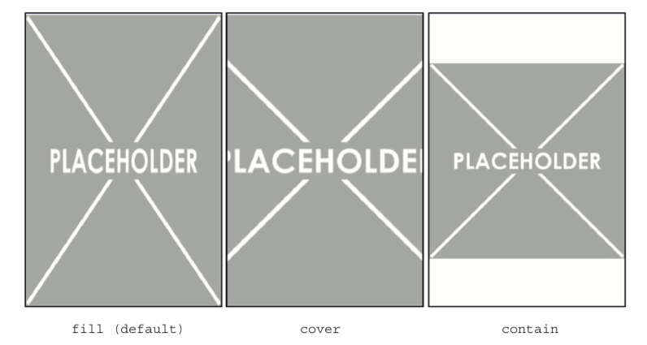

# Image related CSS properties

## `object-fit`

- `object-fit: fill`: default value. The entire image will be resized to fill the `` element.
- `object-fit: cover`: expands the image to fill the box, resulting in part of the image being cut off.
- `object-fit: contain`: resize the image so that it fits entirely in the box, resulting in empty space within the box.

